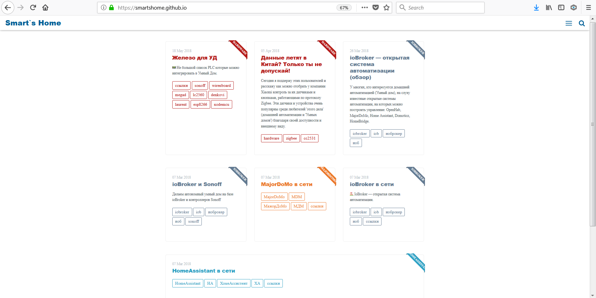

## Smart's Home

База знаний по домашней автоматизации - [Smart's Home](https://smartshome.github.io/)

## Donation

If you liked our work, buy me a coffee 

## License

This theme is free and open source software, distributed under the The MIT License. So feel free to use this Jekyll theme on your site without linking back to me or using a disclaimer.

